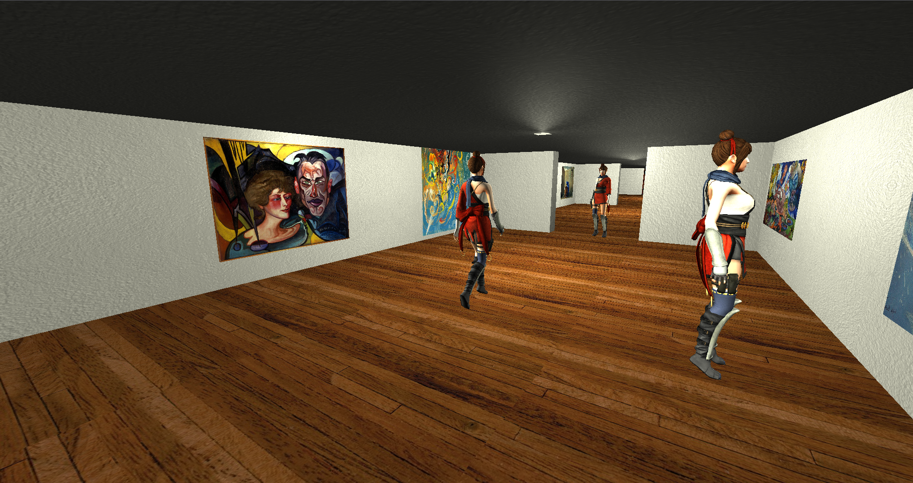

# Virtual Art Museum
## Description
Game written using OpenGL. You can move around a virtual art museum surrounded by animated characters.

## Compilation and running

`$ make` \
`$ ./art-museum [optional path to model]`

## Screenshots

